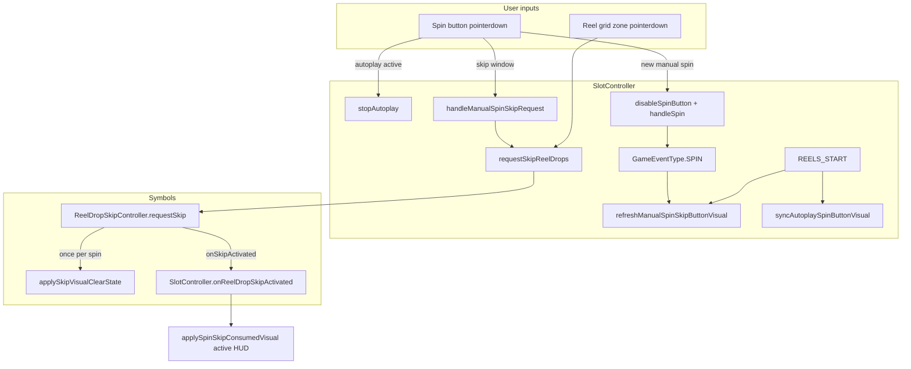

# Spin Button Skip (Manual Spins)

This document describes how **reel-drop skip** was extended to the **spin button** (Oppals reference), how it stays in sync with the **grid skip** hitbox, and how it is kept separate from **autoplay** spin-button behavior.

**That's Bait** implements the same player-facing spec with a few **game-specific** differences called out below — especially around `REELS_STOP` / `enableSpinButton()` (a pitfall we hit when copying Oppals literally).

---

## Summary

| Input | Manual base-game spin | Autoplay sequence |
|-------|----------------------|-------------------|
| **Spin button (first click)** | Starts a normal spin (greyed, non-interactive) | Stops autoplay (if active) |
| **Spin button (while spinning)** | Triggers reel-drop skip (stop icon affordance) | No reel skip — stop icon means **stop autoplay** only |
| **Reel grid tap** | Triggers reel-drop skip (same pipeline) | Same grid skip rules as before (not spin-button UI) |

Both skip entry points (grid + spin button) funnel into a **single** `ReelDropSkipController.requestSkip()` call per spin. Only one skip is accepted per spin.

---

## Player-Facing Behavior

### Manual spin lifecycle

1. **Idle** — Green spin background (`spin_bg`) + rotating spin arrows overlay (`spin_icon`, portrait asset often named `spin.png`).
2. **Spin pressed** — Button greys out immediately (`disableSpinButton(true)` — grey look but still receives taps for click feedback). User cannot start a second spin (`manualSpinClickInFlight` + `isSpinLocked` where applicable).
3. **Reels / client strip active** — Button transitions (~200ms) to:
   - `spin_bg` (no grey tint on base)
   - `autoplay_stop_icon` visible on top (reused asset; means **skip** here, not “stop autoplay”)
   - Spin arrows hidden
   - Button **clickable** for skip only
4. **Skip used** (grid or spin button) — Stop icon **stays visible** (same look as step 3); button stays **interactive** and **not greyed** until the spin resolves. A second skip is blocked by `manualSpinSkipConsumedForCurrentSpin` + `ReelDropSkipController` (not by hiding the icon or greying the button). Extra taps during the same spin are **no-ops logically** but still play spin click feedback (Spine pulse, rotation, SFX) via `playSpinButtonClickFeedback()`.
5. **Spin complete** — Full-color idle spin button restored.

### Autoplay lifecycle (unchanged intent)

- **AUTO_START / `startAutoplay()`** — Hide spin arrows, show stop icon to **stop autoplay**.
- Spin button skip affordance (`showSpinSkipButtonMode`) is **never** applied.
- `syncAutoplaySpinButtonVisual()` owns autoplay HUD so shared events (`REELS_START`, etc.) do not run manual-skip UI logic.

---

## Architecture



### Core components

| File | Responsibility |
|------|----------------|
| `src/game/components/ReelDropSkipController.ts` | Grid hitbox, `skipRequested` guard (one skip per spin), `canSkipNow()`, visual clear via host |
| `src/game/components/Symbols.ts` | Host for skip controller; `requestSkipReelDrops()`, `onSkipActivated()` → SlotController |
| `src/game/components/SlotController.ts` | Spin button layers, manual vs autoplay UI, skip affordance tweens |
| `src/config/AssetConfig.ts` | Controller image keys (`spin`, `spin_icon`, `autoplay_stop_icon`) |

---

## Spin Button Visual Layers

The spin control is **three** Phaser images (portrait + landscape share the same logic):

| Layer | Texture key | Typical asset | Depth (portrait) | Role |
|-------|-------------|---------------|------------------|------|
| Base | `spin` | `spin_bg.png` | 10 | Green circle background |
| Overlay | `spin_icon` | `spin_icon.png` / `spin.png` | 12 | Rotating arrows (idle; hidden while stop icon is shown, including after skip consumed) |
| Skip / autoplay overlay | `autoplay_stop_icon` | `autoplay_stop_icon.png` | 13 | Stop icon (meaning depends on mode) |

Spine spin FX (`spin_button_animation`) sits behind the base image and is unchanged by this feature.

---

## State Flags (SlotController)

| Flag | Purpose |
|------|---------|
| `manualSpinClickInFlight` | Blocks double-clicks while a manual spin is starting (before pipeline locks) |
| `currentSpinAllowsManualButtonSkip` | `true` only for the current **manual** spin; autoplay sets `false` |
| `spinSkipVisualActive` | Manual skip affordance (stop icon) is currently shown |
| `manualSpinSkipConsumedForCurrentSpin` | Skip already used this manual spin; keeps active spin HUD and blocks `disableSpinButton()` from re-greying |
| `shouldReenableSpinButtonAfterFirstAutoplay` | Autoplay-only (Oppals): re-enable spin after first autoplay spin starts — **not used in That's Bait** |

### When `currentSpinAllowsManualButtonSkip` is set

- **`true`** — Manual spin `pointerdown` (before `handleSpin()`).
- **`false`** — `startAutoplay()`, `performAutoplaySpin()`, `AUTO_START`, and when idle `enableSpinButton()` finishes a resolved spin.

All manual skip UI paths check this flag **and** `isAutoplaySpinControlActive()`.

### `isAutoplaySpinControlActive()`

Returns true if any of:

- `gameStateManager.isAutoPlaying`
- `gameStateManager.isAutoPlaySpinRequested`
- `gameData.isAutoPlaying`
- `autoplaySpinsRemaining > 0`

---

## Skip Eligibility (`canOfferManualSpinSkipOnButton`)

Manual spin-button skip is offered only when **all** of the following hold:

1. `currentSpinAllowsManualButtonSkip === true`
2. Not in autoplay (`isAutoplaySpinControlActive()` is false)
3. Skip not already consumed (`!manualSpinSkipConsumedForCurrentSpin` and `!symbols.isSkipReelDropsRequested()`)
4. Not in free-spin autoplay (`!symbols.isFreeSpinAutoplayActive()`)
5. Spin is in a skippable phase:
   - `symbols.isClientSpinPresentationActive()` (client reel strip), **or**
   - `gameStateManager.isReelSpinning`

Grid skip uses the same underlying window via `ReelDropSkipController.canSkipNow()` (plus scatter/buy-feature blocks documented in that file).

---

## API Reference (SlotController)

### Public

| Method | Description |
|--------|-------------|
| `onReelDropSkipActivated()` | Called from `Symbols.onSkipActivated()` after skip is accepted; runs `applySpinSkipConsumedVisual()` if manual spin |
| `showSpinSkipButtonMode(animate?)` | Shows skip affordance (stop icon, interactive). No-op during autoplay or if skip already requested |

### Private (manual skip)

| Method | Description |
|--------|-------------|
| `handleManualSpinSkipRequest()` | Spin-button skip entry; returns `true` if skip was dispatched |
| `refreshManualSpinSkipButtonVisual()` | Reconcile skip vs idle visuals after events (only while presentation is active) |
| `applySpinSkipConsumedVisual(animate?)` | After skip: keep stop icon visible, hide spin arrows, keep button active; sets `manualSpinSkipConsumedForCurrentSpin` |
| `hideSpinSkipButtonMode(animate?)` | Restore idle layers when leaving skip mode without consuming skip |
| `syncAutoplaySpinButtonVisual()` | Autoplay-only HUD; prevents manual skip from clobbering stop-autoplay icon |
| `resetManualSpinSkipButtonState()` | Clears skip flags + kills icon tweens when spin is **fully finished** (idle restore) |
| `isManualSpinPresentationActive()` | `isClientSpinPresentationActive()` **or** `gameStateManager.isReelSpinning` |
| `playSpinButtonClickFeedback()` | Spine pulse + rotation + SFX on **every** tap (including post-skip no-ops) |

### Existing methods (behavioral interaction)

| Method | Manual spin notes |
|--------|-------------------|
| `disableSpinButton(keepInteractive?)` | Greys base + `spin_icon` at 0.5α; hides stop icon (unless autoplay). Manual spins pass `keepInteractive: true` so taps still register. **No-op** while `manualSpinSkipConsumedForCurrentSpin` on the current manual spin |
| `enableSpinButton()` | Autoplay → `syncAutoplaySpinButtonVisual()`; active skip window → `showSpinSkipButtonMode()`; consumed **only while presentation active** → `applySpinSkipConsumedVisual()`; else idle via `resetManualSpinSkipButtonState()` |

---

## Event Wiring

Manual skip UI is refreshed on:

| Event | Manual behavior | Autoplay behavior |
|-------|-----------------|-------------------|
| `GameEventType.SPIN` | `disableSpinButton(true)` + deferred `refreshManualSpinSkipButtonVisual()` | `syncAutoplaySpinButtonVisual()` |
| `GameEventType.SPIN_DROP_START` | `refreshManualSpinSkipButtonVisual()` | `syncAutoplaySpinButtonVisual()` |
| `GameEventType.REELS_START` | `refreshManualSpinSkipButtonVisual()` | `syncAutoplaySpinButtonVisual()` |
| `GameEventType.REELS_STOP` | See **REELS_STOP / idle restore** below | Autoplay branches unchanged |
| `GameEventType.AUTO_START` | Skipped | `syncAutoplaySpinButtonVisual()` + clear manual skip flags |
| `GameEventType.AUTO_STOP` | Restore spin icon; manual skip only if `currentSpinAllowsManualButtonSkip` | — |

`releaseManualSpinClickLock()` runs on `REELS_STOP` (manual) and on failed `handleSpin()` paths (offline, insufficient balance, balance pending).

### REELS_STOP / idle restore (critical when porting from Oppals)

Oppals often calls `enableSpinButton()` directly on manual `REELS_STOP`. That's Bait uses `updateSpinButtonState()` in several paths. **Both must clear skip HUD when the spin is done.**

When `!isManualSpinPresentationActive()` (reels idle, client strip off):

1. Call `resetManualSpinSkipButtonState()` — clears `manualSpinSkipConsumedForCurrentSpin`, `currentSpinAllowsManualButtonSkip`, `spinSkipVisualActive`, and kills tweens on `spin_icon` / `autoplay_stop_icon`.
2. Then `updateSpinButtonState()` or `enableSpinButton()` to restore idle layers.

While presentation is **still** active (`isReelSpinning` or client strip):

- Call `refreshManualSpinSkipButtonVisual()` only (may show skip affordance or consumed HUD).

**Do not** call `applySpinSkipConsumedVisual()` from `enableSpinButton()` when the spin has already finished — that was the root cause of the “stuck stop icon” bug (see Troubleshooting).

---

## Global Skip Coordination (No Duplicate Skips)

### Single controller guard

```text
ReelDropSkipController.requestSkip()
  if (skipRequested || !canSkipNow()) return;
  skipRequested = true;
  disableHitbox();           // grid zone off
  host.onSkipActivated();    // spin button → consumed/active spin HUD (stop icon stays)
  host.applySkipVisualClearState(...);
```

### Entry points

| Source | Call chain |
|--------|------------|
| Spin button | `handleManualSpinSkipRequest()` → `symbols.requestSkipReelDrops()` → `requestSkip()` |
| Reel grid | Zone `pointerdown` → `requestSkip()` |
| Dev console | `window.skipSpin()` in `Game.ts` → `symbols.requestSkipReelDrops()` |
| Client reel strip | `ClientReelSpinController.requestSkip()` (That's Bait: internal strip speed-up; grid/button use `requestSkipReelDrops()` → controller) |

After the first successful `requestSkip()`, the second input (grid or button) is ignored until `clear()` on `REELS_STOP`.

### HUD sync after skip

`Symbols.onSkipActivated()` forwards to `SlotController.onReelDropSkipActivated()`, which:

- Does **nothing** during autoplay / non-manual spins
- Otherwise runs `applySpinSkipConsumedVisual()` (stop icon remains, button stays active)

---

## Animation Timing

| Constant | Value | Used by |
|----------|-------|---------|
| `SlotController.SPIN_SKIP_VISUAL_MS` | `200` | `showSpinSkipButtonMode()`, `hideSpinSkipButtonMode()` |

- **Entering skip mode** (`showSpinSkipButtonMode`, 200ms): fade out `spin_icon`, fade in `autoplay_stop_icon`
- **Skip consumed** (`applySpinSkipConsumedVisual`, instant): keep `autoplay_stop_icon` visible; `spin_icon` stays hidden; no fade
- **Leaving skip mode without consuming** (`hideSpinSkipButtonMode`, 200ms): fade out stop icon, fade in `spin_icon`
- Pass `animate: false` to `showSpinSkipButtonMode` / `hideSpinSkipButtonMode` for instant layer swaps (0ms)

---

## Autoplay vs Manual Stop Icon

The same texture (`autoplay_stop_icon`) is reused for two **different** actions:

| Mode | Stop icon meaning | Click handler |
|------|-------------------|---------------|
| **Manual spin (skip window)** | Skip reel drops | `handleManualSpinSkipRequest()` |
| **Autoplay** | Stop autoplay sequence | `stopAutoplay()` (checked first on `pointerdown`) |

`pointerdown` order on the spin button:

1. If autoplay active → `stopAutoplay()` (never reel skip)
2. Else if `canOfferManualSpinSkipOnButton()` → reel skip
3. Else if click lock / processing → ignore
4. Else → start manual spin

---

## Assets (`AssetConfig.getControllerAssets()`)

Paths follow `assets/controller/{portrait|landscape}/{high|low}/`:

| Key | File |
|-----|------|
| `spin` | `spin_bg.png` |
| `spin_icon` | `spin_icon.png` (arrow overlay; may match art named `spin.png`) |
| `autoplay_stop_icon` | `autoplay_stop_icon.png` |

Quality toggles with network speed (`high` / `low`); screen mode toggles `portrait` / `landscape`.

---

## What Skip Does NOT Change

- Backend spin contract or `handleSpin()` flow
- Autoplay scheduling, counters, or stop-autoplay semantics
- Buy-feature / scatter anticipation skip blocks (`ReelDropSkipController.canSkipNow()`)
- Free-spin autoplay button policy
- Grid skip hitbox geometry (still `ReelDropSkipController` on symbol grid)

Skip remains **visual acceleration**: clear filler/strip presentation, wait for `SPIN_DATA_RESPONSE`, then drop symbols normally (see comment in `ReelDropSkipController.ts`).

---

## Testing Checklist

### Manual spin

- [ ] Single click starts one spin; rapid double-click does not start two spins
- [ ] While client strip or reels run, spin button shows stop icon (not grey arrows only)
- [ ] Tap spin button → skip fires once; second tap does nothing until next spin
- [ ] Tap grid → same; stop icon stays visible (not grey consumed state)
- [ ] After skip, stop icon remains visible; button stays active-looking until spin ends
- [ ] Second tap during same spin does not skip/start a new spin but still plays click feedback (animation + SFX)
- [ ] After spin completes, full idle spin button returns
- [ ] After skip + spin end, button is **not** stuck on stop icon (no animation spam on tap)

### Autoplay

- [ ] Starting autoplay shows stop icon (not manual skip tween from grey idle)
- [ ] Clicking spin during autoplay stops autoplay — does **not** call reel skip
- [ ] `REELS_START` / `SPIN` during autoplay does not hide autoplay stop icon or show manual skip mode
- [ ] Free-round / bonus autoplay contexts still use their existing spin icon rules

### Regression

- [ ] `?demo=true` — spin + skip still work with mocked backend
- [ ] Turbo on/off — skip still allowed (grid rules unchanged)
- [ ] Buy-feature / scatter anticipation spins — skip blocked where `canSkipNow()` already blocks

### Dev helpers

```js
// Browser console (Game scene)
window.skipSpin()
```

---

## Porting Notes (Other Minium Games)

Reference implementations with spin-button skip (similar pattern):

- `kobi_ass/src/game/components/SlotController.ts` — `requestSkipReelDrops` on reel-spinning click
- `hustle_horse/src/game/components/SlotController.ts` — same
- `oppals/src/game/components/SlotController.ts` — full layered affordance + `manualSpinSkipConsumedForCurrentSpin`
- `thats_bait/src/game/components/SlotController.ts` — Oppals spec + **REELS_STOP reset** helpers below

Oppals adds:

- Layered skip affordance (stop icon + tweens)
- `currentSpinAllowsManualButtonSkip` vs autoplay separation
- `onSkipActivated` HUD callback from `ReelDropSkipController`
- `syncAutoplaySpinButtonVisual()` to avoid event cross-talk
- `playSpinButtonClickFeedback()` on every `pointerdown`
- `disableSpinButton(keepInteractive)` for manual spin start

When porting, keep **one** `ReelDropSkipController` instance per spin and route **all** skip UI through `isSkipReelDropsRequested()`.

---

## Oppals reference vs game-specific (incompatibilities)

Use Oppals as the **behavioral** reference, not a line-for-line copy. These differences mattered in That's Bait.

| Area | Oppals | That's Bait / porting note |
|------|--------|----------------------------|
| **REELS_STOP → spin HUD** | Often `enableSpinButton()` directly | May use `updateSpinButtonState()`; **must** call `resetManualSpinSkipButtonState()` when presentation is idle |
| **`enableSpinButton()`** | No “re-apply consumed” on idle | **Must not** unconditionally call `applySpinSkipConsumedVisual()` when `manualSpinSkipConsumedForCurrentSpin` — only while `isManualSpinPresentationActive()` |
| **`refreshManualSpinSkipButtonVisual()`** | Reconciles whenever flags say so | **No-op** when `!isManualSpinPresentationActive()` |
| **Spin start lock** | `manualSpinClickInFlight` + `isProcessingSpin` | Also `isSpinLocked` in pointer handler |
| **UI locks on spin** | `externalControlLock` | Also `bonusUiLock`, `isBuyFeatureLocked`, init free-round exceptions |
| **Autoplay first spin** | `shouldReenableSpinButtonAfterFirstAutoplay` disables spin until first drop | Not implemented — spin stays interactive for stop-autoplay |
| **Click SFX** | `playSpinClickSfx()` | `SoundEffectType.SPIN` (`spin_GT.ogg` / `spinb`) via `playSpinButtonClickFeedback()` |
| **Skip visual clear** | `applySkipVisualClearState` cancels client strip | `applySkipVisualClearState` keeps legacy path: `clientReelSpinController.requestSkip()` + `destroyActiveFillerSymbols` |
| **Grid skip + turbo** | No turbo block in `ReelDropSkipController` | Same (turbo does not disable skip); do not reintroduce old per-game turbo hitbox disable without updating this doc |
| **Free-round HUD** | `isFreeRoundAutoplay` branch in `syncAutoplaySpinButtonVisual` | Uses `isInFreeSpinRound()` / bonus context |

Copying only Oppals’ `enableSpinButton()` body without the idle reset is the most common way to get a **stuck stop icon** after skip.

---

## Troubleshooting

### Stuck stop icon after spin ends

**Symptoms:** After skip + `REELS_STOP`, spin button still shows `autoplay_stop_icon`; rapid taps spam `Spin button spine animation played` / `rotation started` in console without starting a new spin.

**Cause:** `manualSpinSkipConsumedForCurrentSpin` and `currentSpinAllowsManualButtonSkip` still true when `enableSpinButton()` / `updateSpinButtonState()` runs. An early branch re-applies `applySpinSkipConsumedVisual()` instead of restoring idle.

**Fix checklist:**

- [ ] On manual `REELS_STOP` when `!isManualSpinPresentationActive()`, call `resetManualSpinSkipButtonState()` before re-enabling.
- [ ] `enableSpinButton()` only calls `applySpinSkipConsumedVisual()` if presentation is **still** active.
- [ ] `refreshManualSpinSkipButtonVisual()` returns immediately if presentation is not active.
- [ ] `rotateSpinButton()` kills existing tweens on the spin base image before starting a new rotation (avoids feedback pile-up).

### Skip does nothing

Check `ReelDropSkipController.canSkipNow()` — buy-feature spin, scatter anticipation flags, win dialog, critical-sequence lock (That's Bait: `isCriticalLockBlockingSkip` on host).

### Double spin on fast click

Ensure `manualSpinClickInFlight` / `isProcessingSpin` / game-specific locks are set **before** `await handleSpin()`.

---

## File Change Index

| File | Changes |
|------|---------|
| `src/game/components/SlotController.ts` | Skip visuals, flags, `resetManualSpinSkipButtonState`, event hooks, autoplay sync, click feedback |
| `src/game/components/Symbols.ts` | `ReelDropSkipController` host, `applySkipVisualClearState`, `onSkipActivated()` → SlotController |
| `src/game/components/ReelDropSkipController.ts` | Grid hitbox, `onSkipActivated`, one skip per spin |
| `src/game/scenes/Game.ts` | `window.skipSpin()` dev helper |

---

## Grave Threat implementation status

Implemented in `grave_threat/` with modular `SpinButtonController` + `SlotController` orchestration and the REELS_STOP idle-reset fix. When syncing from Oppals upstream, re-merge **SlotController** skip sections carefully and preserve:

## That's Bait reference status

Implemented in `thats_bait/` with the REELS_STOP idle-reset fix. When syncing from Oppals upstream, re-merge **SlotController** skip sections carefully and preserve:

- `resetManualSpinSkipButtonState()`
- `isManualSpinPresentationActive()`
- REELS_STOP branches that reset before `updateSpinButtonState()`

---

## Related Docs

- `OBJECT_POOLING_GUIDE.md` — unrelated to skip; general performance
- `.cursor/rules/autoplay-bonus-persistence-and-control-locks.mdc` — autoplay control locks (complementary)
- `AUTOPLAY_STOP_ON_BET_FAILED_POPUP.md` — autoplay stop on errors

---

*Last updated: post-skip stop icon stays visible during spin; idle restore via `resetManualSpinSkipButtonState` on REELS_STOP; Oppals porting incompatibilities + troubleshooting for stuck stop icon.*
